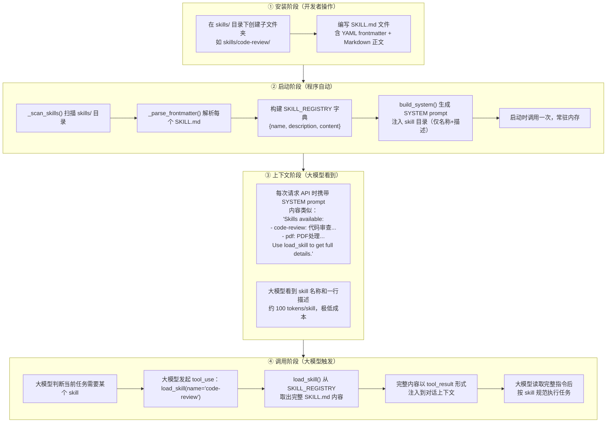
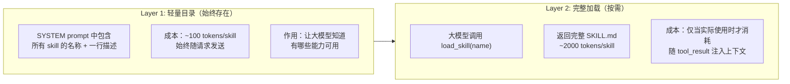
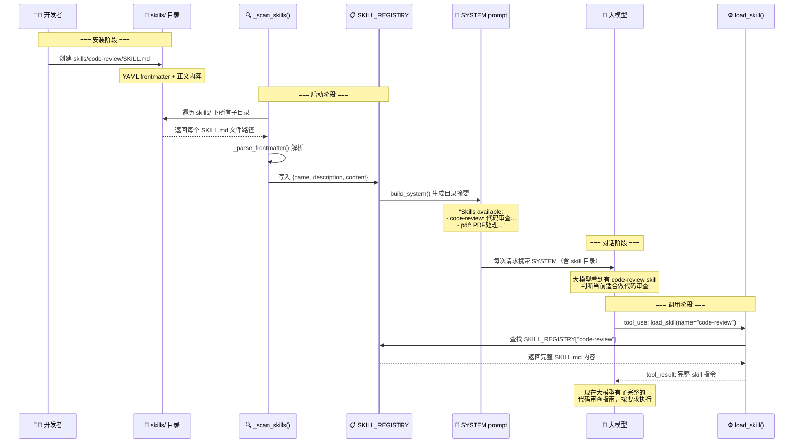
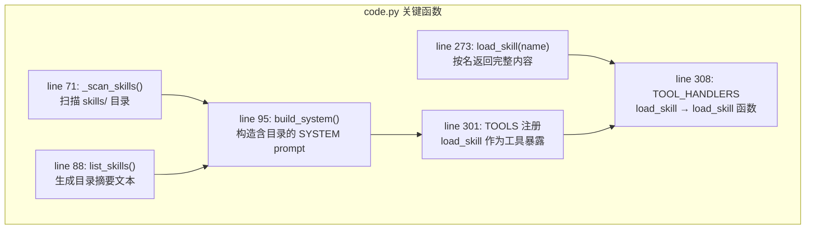

# s07 Skill 加载机制

## 1. 整体流程：Skill 如何安装、生效、被调用

## 2. 两层加载架构

## 3. 数据流详解

## 4. 关键代码对应

## 5. 总结

| 阶段 | 谁操作 | 做什么 | 成本 |
|------|--------|--------|------|
| 安装 | 开发者 | 在 `skills/<name>/SKILL.md` 写文件 | 0 tokens |
| 启动 | `_scan_skills()` | 扫描目录，解析 frontmatter，构建注册表 | 0 tokens |
| 注入 | `build_system()` | 把 skill 名称+描述写入 SYSTEM prompt | ~100 tokens/skill |
| 触发 | 大模型 | 判断任务需要 skill，调用 `load_skill(name)` | 0 额外 tokens |
| 加载 | `load_skill()` | 从注册表取完整 SKILL.md 返回 | ~2000 tokens/skill |

**核心设计**：两级加载 —— 目录始终在线（便宜），完整内容按需注入（贵但精准）。大模型通过 SYSTEM prompt 知道有哪些 skill，通过 tool_use 按名请求完整内容。
